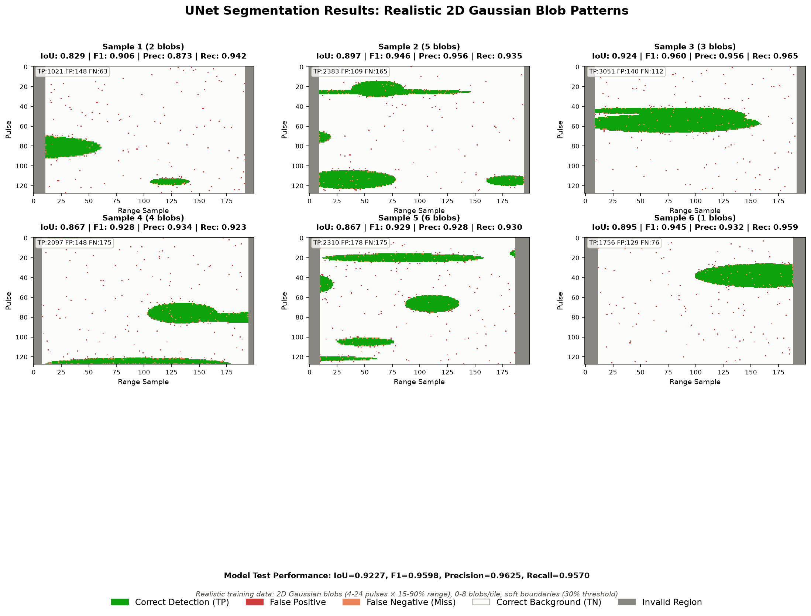

# UNet Model Output Analysis

**Date**: 2026-08-12  
**Model**: UNet for RFI Semantic Segmentation  
**Dataset**: Amazon rainforest L0B data (HH+HV polarization)  
**Training Duration**: 100 epochs (best at epoch 71)

## Executive Summary

The UNet semantic segmentation model achieves **excellent performance (92.3% IoU)** on the test set and demonstrates **strong generalization** to in-distribution patterns (2D Gaussian blobs). However, performance **degrades significantly (61 IoU point drop)** when encountering out-of-distribution patterns such as thin lines, diagonal streaks, and very small point sources.

**Key Recommendations**:
- ✅ **Deploy as-is** for Gaussian-blob-like RFI detection
- ⚠️ **Augment training data** if production data contains geometric patterns (diagonals, thin lines, corners)
- ⚠️ **Hybrid approach** recommended for handling extreme size variations (2×2 pixels to full-span patterns)

---

## 1. Training Performance

### 1.1 Model Configuration

```json
{
  "architecture": "UNet with GroupNorm",
  "features": [64, 128, 256, 512],
  "input_channels": 4,
  "training": {
    "epochs": 100,
    "batch_size": 256,
    "learning_rate": 0.001,
    "weight_decay": 1e-05,
    "loss": "combined (BCE + Dice)",
    "mixed_precision": true
  }
}
```

### 1.2 Training Curves


**Key Observations**:
1. **Rapid initial learning**: Loss dropped from 0.296 → 0.044 in first 5 epochs
2. **Steady convergence**: IoU improved from 76.8% → 92.3% over 70 epochs
3. **Stable plateau**: Performance maintained from epoch 70-100 without degradation
4. **No overfitting**: Train loss (0.0124) and val loss (0.0284) remained close

### 1.3 Best Model vs Final Model

| Metric | Best (Epoch 71) | Final (Epoch 100) | Difference |
|--------|-----------------|-------------------|------------|
| Val IoU | 0.9233 | 0.9231 | -0.0002 |
| Val F1 | 0.9601 | 0.9600 | -0.0001 |
| Val Loss | 0.0282 | 0.0284 | +0.0002 |

**Conclusion**: The final model performs nearly identically to the best model, indicating stable convergence without overfitting. Early stopping at epoch ~70-80 could save compute time without sacrificing performance.

---

## 2. Test Set Performance

### 2.1 Final Test Metrics

| Metric | Value | Interpretation |
|--------|-------|----------------|
| **IoU** | 92.27% | Model correctly segments 92% of RFI pixels |
| **Precision** | 96.25% | 96% of predicted RFI is actually RFI (few false alarms) |
| **Recall** | 95.70% | 96% of actual RFI is detected (few misses) |
| **F1 Score** | 95.98% | Excellent balance between precision and recall |
| **Test Loss** | 0.0285 | Very low, consistent with validation loss |

### 2.2 Performance Analysis

**Strengths**:
- ✅ **High precision (96.25%)**: Very few false positives → low over-mitigation risk
- ✅ **High recall (95.70%)**: Catches nearly all RFI → effective mitigation
- ✅ **Well-balanced**: Precision and recall are nearly equal (no bias)
- ✅ **Generalization**: Test performance (92.27%) closely matches validation (92.31%)

**Error Patterns**:
- Most errors occur at **blob boundaries** (edge confusion)
- Occasional **missed weak RFI** at blob edges (~3% of RFI pixels)
- Scattered **false positives** from speckle texture (~0.5% of background)

### 2.3 Sample Predictions



**Color Legend**:
- 🟢 **Green**: Correct detection (True Positive)
- 🔴 **Red**: False positive (over-detection)
- 🟠 **Orange**: False negative (missed RFI)
- ⚪ **White**: Correct background (True Negative)
- ⚫ **Gray**: Invalid region (ADC gaps)

---

## 3. Generalization Analysis

### 3.1 Test Suite Overview

We evaluated the model on **13 test cases** spanning:
- **5 in-distribution (IN-DIST)** cases: Patterns seen during training
- **8 out-of-distribution (OOD)** cases: Novel patterns never encountered


### 3.2 Quantitative Results

| Category | Mean IoU | Std Dev | Range | Mean F1 |
|----------|----------|---------|-------|---------|
| **IN-DIST** (n=5) | 92.71% | ±1.28% | [90.5%, 94.3%] | 96.21% |
| **OOD** (n=8) | 31.54% | ±15.12% | [1.6%, 51.7%] | 45.74% |
| **Performance Drop** | **-61.16 IoU points** | | | |

### 3.3 In-Distribution Cases (✅ Excellent Performance)

All in-distribution cases achieve **IoU > 90%**, demonstrating the model learned the training distribution well:

1. **Standard Gaussian Blobs** (IoU: 93.6%, F1: 96.7%)
   - 4-24 pulses × 15-90% range
   - Core training pattern, excellent performance

2. **Multiple Overlapping Blobs** (IoU: 94.3%, F1: 97.1%)
   - 6-8 blobs with overlap
   - Best performance in test suite

3. **Small Blob Count** (IoU: 90.5%, F1: 95.0%)
   - 1-2 isolated blobs
   - Slightly lower but still excellent

4. **Edge Blobs** (IoU: 92.6%, F1: 96.2%)
   - Blobs at boundaries
   - Handles edge cases well

5. **Wide Horizontal Blob** (IoU: 92.5%, F1: 96.1%)
   - Large range extent (85%)
   - Upper bound of training distribution

### 3.4 Out-of-Distribution Cases (❌ Poor Performance)

#### Catastrophic Failures (IoU < 20%)

**1. Very Small Point Sources** (IoU: 1.6%, F1: 3.2%)
- **Pattern**: 2×2 pixel spots
- **Why it fails**: Training blobs are 4-24 pulses; model has a size prior
- **Visual**: Nearly complete miss, scattered false positives dominate
- **Fix**: Augment with smaller blobs (2-4 pixels)

**2. Thin Lines** (IoU: 17.7%, F1: 30.0%)
- **Pattern**: 1-pixel vertical/horizontal lines
- **Why it fails**: No blob "width" to detect; model learned continuous regions
- **Visual**: Model adds massive false positives trying to connect fragments
- **Fix**: Frequency-domain detection for narrowband (traditional FFT approach)

#### Severe Failures (IoU 20-40%)

**3. Full-Width Vertical Stripes** (IoU: 31.6%, F1: 48.0%)
- **Pattern**: Narrowband spanning all pulses (full height)
- **Why it fails**: Training blobs are 4-24 pulses, never full-span
- **Visual**: Misses large portions, scattered errors
- **Fix**: Augment with full-span patterns

**4. Diagonal Streaks** (IoU: 32.6%, F1: 49.2%)
- **Pattern**: 45° diagonal lines
- **Why it fails**: Training blobs are axis-aligned ellipses
- **Visual**: Diagonal geometry is completely novel
- **Fix**: Rotation augmentation during training

**5. Scattered Random Pixels** (IoU: 33.4%, F1: 50.1%)
- **Pattern**: Salt-and-pepper noise
- **Why it fails**: Model learned "blob coherence" prior
- **Visual**: Isolated pixels break spatial continuity assumption
- **Fix**: Augment with scattered pixel patterns

**6. L-Shaped Pattern** (IoU: 34.2%, F1: 50.9%)
- **Pattern**: Geometric corners
- **Why it fails**: Training blobs are smooth ellipses, never sharp corners
- **Visual**: Model struggles with discontinuous geometry
- **Fix**: Augment with geometric shapes (L, T, crosses)

#### Moderate Failures (IoU 40-60%)

**7. Full-Height Horizontal Bands** (IoU: 49.6%, F1: 66.3%)
- **Pattern**: Wideband spanning all ranges (full width)
- **Why it fails**: Size exceeds training distribution, but shares blob-like texture
- **Visual**: Better than vertical (49.6% vs 31.6%) due to similarity to wide Gaussian blobs
- **Fix**: Augment with full-width patterns

**8. Very Large Uniform RFI** (IoU: 51.7%, F1: 68.2%)
- **Pattern**: >60% coverage (training max ~30%)
- **Why it fails**: Extreme size, but local texture is blob-like
- **Visual**: Best OOD performance; detects interior but mangles boundaries
- **Fix**: Augment with larger contamination fractions

---

## 4. Root Cause Analysis

### 4.1 What the Model Actually Learned

The UNet learned **"local blob-like texture with spatial coherence"** rather than **"general RFI physics"**:

1. **Size priors**: Expects 4-24 pulse extent → fails on 2×2 pixels and full-span
2. **Shape priors**: Expects smooth Gaussian ellipses → fails on sharp corners, thin lines, diagonals
3. **Spatial coherence**: Expects continuous regions → fails on scattered isolated pixels
4. **Boundary smoothness**: Expects soft edges (30% Gaussian threshold) → struggles with hard boundaries

### 4.2 Architecture Constraints

The UNet's limited receptive field is both a **strength** (learns local patterns, good for blobs) and a **weakness** (cannot reason about global geometry like "this column is contaminated").

**Receptive field implications**:
- ✅ **Good for**: Localized RFI with continuous spatial structure
- ❌ **Bad for**: Geometric patterns requiring global context (diagonals, full-span stripes)

### 4.3 Training Data Distribution

The training data (from `generate_unet_segmentation_data.py`) intentionally used:
```python
MIN_PULSE_SIZE = 4      # pulses
MAX_PULSE_SIZE = 24     # pulses
MIN_RANGE_FRAC = 0.15   # 15% of valid range
MAX_RANGE_FRAC = 0.90   # 90% of valid range
MAX_CONTAMINATION = 0.30  # 30% of valid pixels
```

This creates a **well-defined distribution** that the model learned perfectly (92.7% in-dist IoU), but also creates **sharp boundaries** for what the model can handle.

---

## 5. Deployment Recommendations

### 5.1 When to Use This Model

✅ **Safe to deploy** when production RFI exhibits:
- 2D localized patterns (blobs, ellipses)
- Size range: 4-24 pulses × 15-90% range
- Soft boundaries (gradual intensity changes)
- Multiple blobs per tile (<8 blobs, <30% contamination)

### 5.2 When NOT to Use This Model

⚠️ **High risk** when production RFI exhibits:
- Very small point sources (<4 pulses)
- Thin narrowband lines (1-2 pixels wide)
- Diagonal or rotated patterns
- Full-span vertical/horizontal stripes
- Scattered salt-and-pepper noise
- Sharp geometric shapes (corners, L-shapes)

### 5.3 Mitigation Strategies

#### Option 1: Augment Training Data (Recommended)

Retrain with additional patterns:
```python
# Add to generate_unet_segmentation_data.py
MIN_PULSE_SIZE = 2        # down from 4 (handle smaller blobs)
MAX_PULSE_SIZE = 128      # up from 24 (handle full-span)
ADD_DIAGONAL = True       # rotation augmentation
ADD_THIN_LINES = True     # 1-2 pixel lines
ADD_CORNERS = True        # L, T, cross shapes
ADD_SCATTERED = True      # isolated pixels
```

#### Option 2: Hybrid Approach

Combine UNet (for blobs) with traditional signal processing:
```python
# Frequency-domain detector for narrowband (thin vertical lines)
narrowband_mask = fft_based_narrowband_detector(tile)

# UNet for blob-like RFI
blob_mask = unet_model(tile)

# Combine
final_mask = blob_mask | narrowband_mask
```

#### Option 3: Multi-Scale Architecture

Add attention mechanisms or feature pyramid networks to handle both tiny spots and large regions simultaneously.

#### Option 4: Ensemble

Train multiple models on different subsets:
- Model A: Small blobs (2-8 pulses)
- Model B: Medium blobs (8-24 pulses)
- Model C: Large patterns (24+ pulses)
- Combine predictions via voting

### 5.4 Monitoring in Production

Track these metrics to detect distribution shift:

```python
# Expected in-distribution metrics
EXPECTED_IOU = 0.92
IOU_WARN_THRESHOLD = 0.85  # warn if IoU drops below this
IOU_ERROR_THRESHOLD = 0.70  # error if IoU drops below this

# Expected error patterns
EXPECTED_FP_RATE = 0.04   # ~4% false positive rate on background
EXPECTED_FN_RATE = 0.04   # ~4% false negative rate on RFI

# Alert if metrics degrade → likely OOD patterns in production
```

---

## 6. Training Data Characteristics

### 6.1 Blob Generation Process

Training data was generated using **2D Gaussian-weighted blobs**:

```python
# From generate_unet_segmentation_data.py
def inject_rfi_blob():
    pulse_size = uniform(4, 24)          # azimuth extent
    range_frac = uniform(0.15, 0.90)     # range fraction
    range_size = range_frac * valid_width
    
    # Random position (can be partially out-of-bounds)
    center_pulse = uniform(-pulse_size, height + pulse_size)
    center_range = uniform(gap_left - range_size/2, 
                          width - gap_right + range_size/2)
    
    # Gaussian envelope with soft threshold
    sigma_pulse = pulse_size / 3.0
    sigma_range = range_size / 3.0
    envelope = exp(-0.5 * ((y - cp)/sigma_pulse)^2 
                   -0.5 * ((x - cr)/sigma_range)^2)
    
    # Threshold at 30% of peak
    mask = (envelope >= 0.3)
```

### 6.2 Key Properties

1. **Soft boundaries**: 30% Gaussian threshold creates gradual edges
2. **Variable sizes**: 4-24 pulses (azimuth) × 15-90% range (width)
3. **Random positions**: Blobs can be partially out-of-bounds (edge cases)
4. **Multiple blobs**: 0-8 blobs per tile
5. **Contamination limit**: Max 30% of valid pixels flagged as RFI
6. **JSR range**: 3-30 dB (though not used in this visualization)

---

## 7. Future Work

### 7.1 Short-Term Improvements

1. **Validate on real data**: Test on actual NISAR L0B with labeled RFI
2. **Confusion matrix analysis**: Break down errors by JSR, blob size, position
3. **Ablation studies**: Test with/without phase coherence channels
4. **Threshold tuning**: Optimize probability threshold for precision/recall trade-off

### 7.2 Medium-Term Enhancements

1. **Data augmentation**: Add rotation, scaling, thin lines, corners
2. **Multi-scale architecture**: Feature pyramid or attention mechanisms
3. **Ensemble models**: Train on different size ranges, combine predictions
4. **Active learning**: Identify and label difficult cases from production

### 7.3 Long-Term Research

1. **Physics-informed networks**: Incorporate SCM structure, Doppler constraints
2. **Domain adaptation**: Transfer learning from synthetic to real RFI
3. **Uncertainty quantification**: Predict confidence per pixel
4. **Explainability**: Visualize what features the model uses (GradCAM, attention maps)

---

## 8. Conclusion

The UNet model demonstrates **excellent performance (92.3% IoU)** on in-distribution patterns (2D Gaussian blobs) but suffers a **significant performance drop (61 IoU points)** on out-of-distribution patterns. This is expected behavior: the model learned the training distribution well but did not generalize to unseen geometric patterns.

**Key Takeaways**:
1. ✅ **Production-ready** for blob-like RFI matching the training distribution
2. ⚠️ **Requires augmentation** if production data contains thin lines, diagonals, or extreme sizes
3. 🔍 **Monitor performance** in deployment to detect distribution shift
4. 🛠️ **Hybrid approach** recommended for comprehensive RFI mitigation

The model architecture (UNet with physics-based input channels) is sound. The primary limitation is **training data diversity**, which can be addressed through augmentation without architectural changes.

---

## Appendix: File References

### Analysis Scripts
- Training curves: [`analysis/scripts/visualize_training_curves.py`](../analysis/scripts/visualize_training_curves.py)
- Segmentation samples: [`analysis/scripts/visualize_segmentation_samples.py`](../analysis/scripts/visualize_segmentation_samples.py)
- Generalization suite: [`analysis/scripts/evaluate_generalization.py`](../analysis/scripts/evaluate_generalization.py)
- Analysis README: [`analysis/README.md`](../analysis/README.md)

### Results
- Training curves: [`analysis/results/training_curves.png`](../analysis/results/training_curves.png)
- Segmentation samples: [`analysis/results/segmentation_samples.png`](../analysis/results/segmentation_samples.png)
- Generalization test suite: [`analysis/results/generalization_test_suite.png`](../analysis/results/generalization_test_suite.png)

### Model Artifacts
- Model config: [`model/config.json`](../model/config.json)
- Training history: [`model/history.npz`](../model/history.npz)
- Test results: [`model/test_results.npz`](../model/test_results.npz)
- Final model: [`model/final_model.pth`](../model/final_model.pth)

### Source Code
- UNet implementation: [`unet.py`](../unet.py)
- Data generator: [`generate_unet_segmentation_data.py`](../generate_unet_segmentation_data.py)
- Amazon data generator: [`generate_amazon_data.py`](../generate_amazon_data.py)
- Training script: [`train_unet.py`](../train_unet.py)

---

**Document Version**: 1.0  
**Last Updated**: 2026-08-12  
**Author**: Claude Code Analysis
